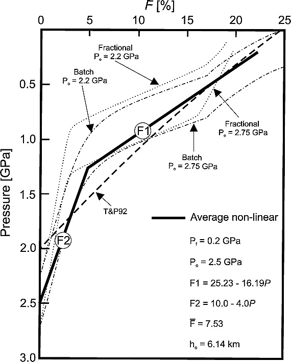

下图显示了 Asimow et al., (1999, 2001)结果摘要。  对于批量和分级熔化模型(batch and fractional melting models)。 图中还包括广泛使用的准线性模型（即，固定常数$\gamma$，以下简称 $QL$）[Langmuir et al., 1992; Turcotte and Phipps Morgan, 1992]。 *本工作中使用的首选非线性模型以粗实线显示*。 它对应于来源中含有大约 180-190 ppm H2O 的橄榄岩固相线 [Hirth and Kohlstedt, 1996; Asimow et al., 2004]。 这里需要注意的是，虽然 $\gamma$ 的形式可能因一项工作而异，但 $(Po − Pf)$ 和$\bar{F}$方程图像的乘积在所有情况下都应该具有可比性。

不同熔化模型的部分熔化程度与深度的关系。 两条点线和两条点划线分别是两种不同 Po 下分级熔融和分批熔融的等熵熔融模型 [来自 Asimow 等人，1999 年，2001 年]。 虚线是 Turcotte 和 Phipps Morgan [1992] 的模型。 *实线是Afonso et al., (2008)的首选模型*。 F1 和 F2 是平均非线性模型数值实现中使用的两个线性函数。 这些函数中的压力以 GPa 为单位。 其他相关参数列于右下角。